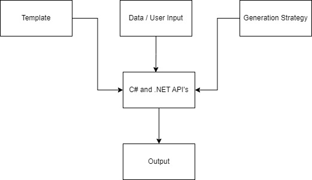

# Code Generation - Hello World
Introductory Code Generation project 

## Give a Star! :star:

If you like or are using this project to learn or start your solution, please give it a star. Thanks!

## Table of Contents
- [What is Design-Time Code Generation](#whatisit)
- [How to run locally](#usage)
- [How to Test](#roadmap)
  

## What is Design-Time Code Generation

 


 ### Template

 ```text
 public record struct @(Model.Name)();
 ```

 ### Data / Model / User Input
 ```data
 {
    "simpleTypes": [
      {
        "name": "HelloWorld"
      }
    ]
}
 ```

 ### Generation Strategy
 ```csharp
 async Task GenerateAsync(JsonElement model)
{
    var template = GetTemplate("Record");

    var templateProcessor = new RazorTemplateProcessor();

    var result = await templateProcessor.ProcessAsync(template, new { Name = model.GetProperty("name").GetString() });

    File.WriteAllText($@"..\..\..\..\Target\{model.GetProperty("name").GetString()}.g.cs", result);
}
 ```

## How to run locally


## How to test
